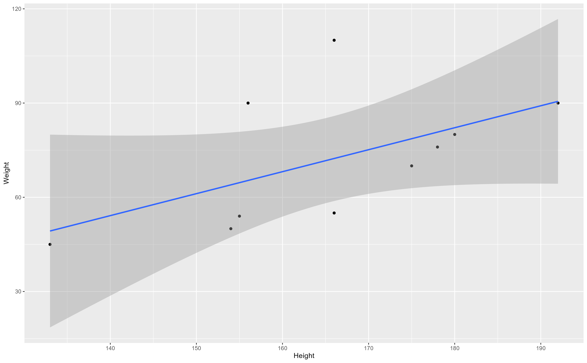

The structure below is a possible setup for a data analysis project (including the course project). For a manuscript, adjust as needed.


# Summary/Abstract
_Write a summary of your project._


# Introduction 

## General Background Information

Covid-19 pandemic brought significant morbidity and mortality globally with more than 3 million deaths worldwide. following which efforts were focused on development of effective vaccines in time.In december 2020, the Food and Drug Administration (FDA) issued emergency use authorizations for the Pfizer-BioNTech and Moderna COVID-19 vaccines[@rosner_myocarditis_2021]. 
Both of these are mRNA vaccines encoding the stabilized prefusion spike glycoprotein of SARS-CoV-2 and demonstrated excellent safety and clinical efficacy profiles in large clinical trials.However, soon after there were reports of myocarditis and pericarditis in mRNA vaccine recipients. These were more common among young men after receiving their 2nd dose. Myocarditis is the inflammation of the heart muscle whereas, pericarditis is an inflammation of the thin tissue surrounding the heart. from there on myocarditis is used to refer to myocarditis, pericarditis or myopericarditis. In June 2021, the advisory committee on immunization practices determined that the benefits of using mRNA COVID-19 vaccines clearly outweigh the risks. a few research studies have been done primarily describing case-reports of myocarditis after mRNA COVID-19 vaccines and some describing the characteristics of participants[@rosner_myocarditis_2021],[@gargano_use_2021]. However, none of the studies have been conducted so far to look at the patient characteristics associated with adverse outcomes such as hospitalization and death. Therefore, the aim of this study is to explore the characteristics of these patients and identify factorts that could be associated with poor outcomes. Finding these answers could help in identifying high risk patients, providing vigilant care and surveillance which could help in preventing adverse outcomes. 


## Description of data and data source

This data set was established by the US. Department of Health and Human Services(DHHS), co-administered by the Food and Drug Administration (FDA) and the Centers for Disease Control (CDC), to accept all reports of suspected adverse events after the administration of any US licensed vaccine.VAERS is used to continually monitor reports to determine whether any vaccine or vaccine lot has a higher than expected rate of events.

Health care providers are encouraged to report adverse events, even if they are not certain if it was related to the vaccine. since it is difficult to distinguish whether an adverse event was due to a drug or not. all types of adverse events are reported whether or not related to vaccine. The primary purpose for maintaining the database is to serve as an early warning for adverse events not detected during pre-market testing.

in 2007, the VAERS coding system was converted to an international coding system called MedDRA (Medical Dictionary for Regulatory Activities) that is used globally. It uses key words representing medical conditions described in the case report and converts them to standardized codes. There are more than 17,000 preferred term codes in the system. 

The public dataset comprises of three separate excel files. the first one contains information on demographics such as age, sex, date, symptoms, vaccination date, event onset date and outcomes such as hospitalization, death, disability, recovery, type of facility, diagnostic tests, medications, illnesses and allergies. the second data set contains information on vaccine type, lot, doses administered, route, and site. Third database contains information on symtoms of all adverse events. all databases have one common element which is identification number and it will be used to merge these three data sets. These data sets comprises of individuals receiving Pfizer or Moderna Covid-19 vaccine during January 1 to Sept 3, 2021. a total of 495514 individuals are included in the data set. 

Following links provide additional information about the data set. https://vaers.hhs.gov/data/datasets.html? and https://vaers.hhs.gov/docs/VAERSDataUseGuide_November2020.pdf


## Questions/Hypotheses to be addressed

Following are the research questions that will be answered through this project

1) What are the characteristics of individuals developing myocarditis post Pfizer or Moderna Covid-19 vaccines

2) what are the factors associated with hospitalization and death among patients developing myocarditis post covid-19 vaccines. 

# Methods and Results

_In most research papers, results and methods are separate. You can combine them here if you find it easier. You are also welcome to structure things such that those are separate sections._

# Outcomes

The specific outcomes would be hospitalization and death. 


## Data aquisition
_As applicable, explain where and how you got the data. If you directly import the data from an online source, you can combine this section with the next._

## Data import and cleaning
_Write code that reads in the file and cleans it so it's ready for analysis. Since this will be fairly long code for most datasets, it might be a good idea to have it in one or several R scripts. If that is the case, explain here briefly what kind of cleaning/processing you do, and provide more details and well documented code somewhere (e.g. as supplement in a paper). All materials, including files that contain code, should be commented well so everyone can follow along._

# Analysis Plan 

Descriptive analysis will be done. mean with standard deviation or median with interquartile range will be reported for all quantitative variables depending on distribution. Frequencies with percentages will be reported for all categorical variables. for comparing quantitative variables across categories of exposure or outcomes, independent sample t-test will be used. for categorical variables chi square test will be used for comparison. a p-value of <0.05 will be considered as statistically significant. univariate logistic regression will be done to identify factors associated with hospitalization and death. unadjusted odds ratios with 95% confidence intervals will be reported. all biologically plausible confounders and effect modifiers will be identified and tested in the model.Correlations will be assessed between all variables. if correlation between two independent variables is >0.8 or higher than the correlation between independent and outcome variables, multicollinearity will be considered and one of the variables will be considered to drop. for multivariate model, biological based model will be developed considering potential confounders and effect modifiers in different combinations. Adjusted odds ratios with 95% confidence intervals will be reported


## Exploratory analysis

_Use a combination of text/tables/figures to explore and describe your data. You should produce plots or tables or other summary quantities for the most interesting/important quantities in your data. Depending on the total number of variables in your dataset, explore all or some of the others. FIgures produced here might be histograms or density plots, correlation plots, etc. Tables might summarize your data._

_Continue by creating plots or tables of the outcome(s) of interest and the predictor/exposure/input variables you are most interested in. If your dataset is small, you can do that for all variables. Plots produced here can be scatterplots, boxplots, violinplots, etc. Tables can be simple 2x2 tables or larger ones._

_To get some further insight into your data, if reasonable you could compute simple statistics (e.g. t-tests, simple regression model with 1 predictor, etc.) to look for associations between your outcome(s) and each individual predictor variable. Though note that unless you pre-specified the outcome and main exposure, any "p<0.05 means statistical significance" interpretation is not valid._

Table \@ref(tab:summarytable) shows a table summarizing the data.


```{r summarytable,  echo=FALSE}
resulttable=readRDS("../../results/summarytable.rds")
knitr::kable(resulttable, caption = 'Data summary table.')
```


Figure \@ref(fig:resultfigure) shows a scatterplot figure produced by one of the R scripts.

```{r resultfigure,  fig.cap='Analysis figure.', echo=FALSE}

```


## Full analysis

_Use one or several suitable statistical/machine learning methods to analyze your data and to produce meaningful figures, tables, etc. This might again be code that is best placed in one or several separate R scripts that need to be well documented. You want the code to produce figures and data ready for display as tables, and save those. Then you load them here._

Example table \@ref(tab:resulttable) shows a table summarizing a linear model fit.

```{r resulttable,  echo=FALSE}
resulttable=readRDS("../../results/resulttable.rds")
knitr::kable(resulttable, caption = 'Linear model fit table.')
```


# Discussion

## Summary and Interpretation
_Summarize what you did, what you found and what it means._

## Strengths and Limitations
_Discuss what you perceive as strengths and limitations of your analysis._

## Conclusions
_What are the main take-home messages?_

_Include citations in your Rmd file using bibtex, the list of references will automatically be placed at the end_
 

Note that this cited reference will show up at the end of the document, the reference formatting is determined by the CSL file specified in the YAML header. Many more style files for almost any journal [are available](https://www.zotero.org/styles). You also specify the location of your bibtex reference file in the YAML. You can call your reference file anything you like, I just used the generic word `references.bib` but giving it a more descriptive name is probably better.


# References


